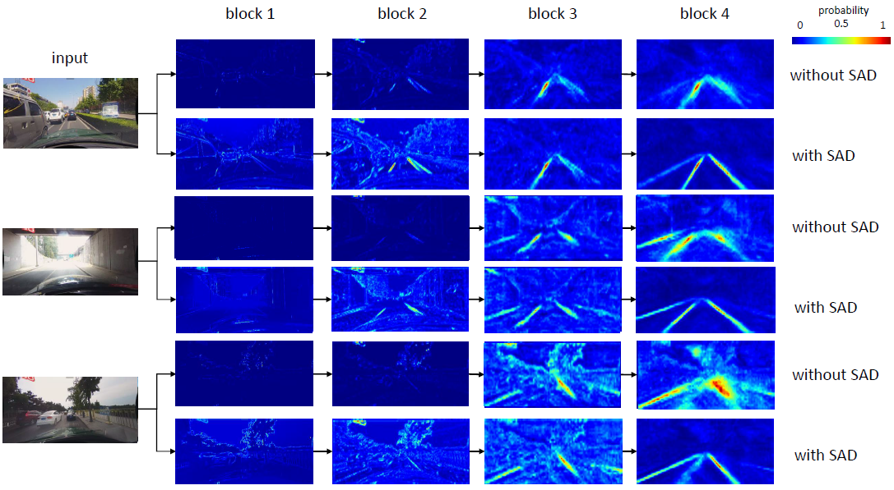
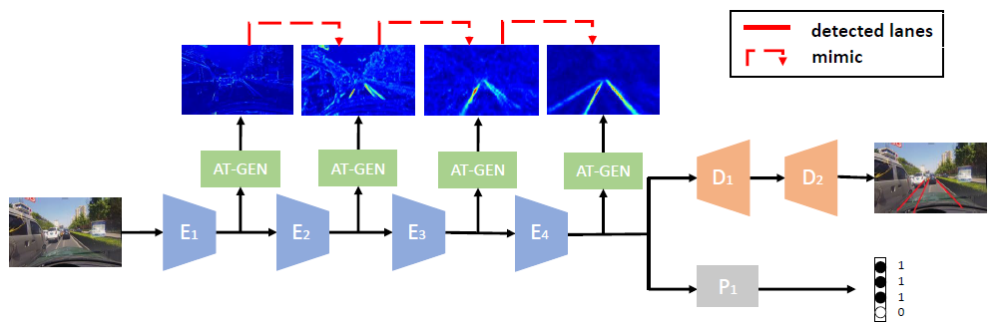

# ENET-SAD-LaneDetection

First of all I would like to thank [Mr. Kwot Sin Lee](https://www.linkedin.com/in/kwotsin/) and [Dr. Yuenan Hou](https://www.linkedin.com/in/yuenan-hou-859589136/) for their support in implementing this paper

This code is implemented for the paper ["Learning Lightweight Lane Detection CNNs by Self Attention Distillation"](https://arxiv.org/pdf/1908.00821)

**Self Attention Distillation
(SAD)**, which allows a model to learn from itself and gains
substantial improvement without any additional supervision
or labels. Specifically, we observe that attention maps extracted
from a model trained to a reasonable level would
encode rich contextual information. The valuable contextual
information can be used as a form of ‘free’ supervision
for further representation learning through performing topdown
and layer-wise attention distillation within the network
itself. SAD can be easily incorporated in any feedforward
convolutional neural networks (CNN) and does not
increase the inference time

### Self Attention Distillation

### ENET-SAD Architecture

